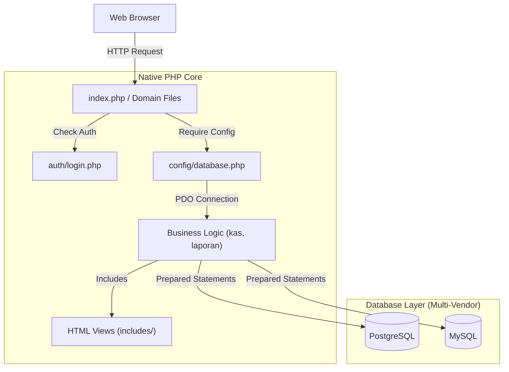
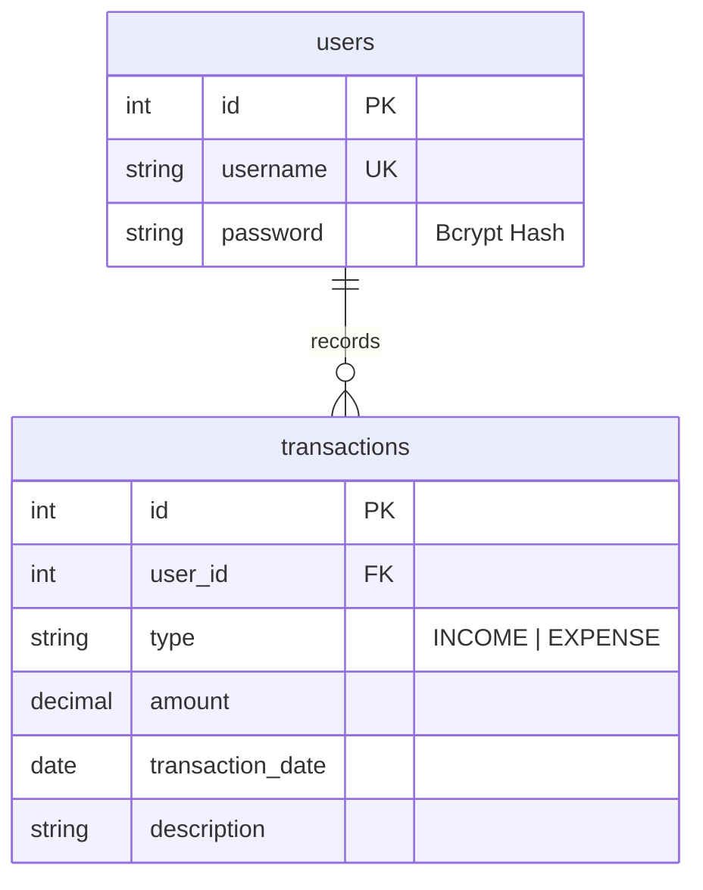

<div align="center">
  
  <br /><br />
  <a href="https://cash-flow-pink.vercel.app/">
    
  </a>
</div>

<p align="center">
  <a href="#"></a>
  <a href="#"></a>
  <a href="#"></a>
  <a href="#"></a>
</p>

---

## 📑 Table of Contents

- [About This Project](#-about-this-project)
- [Key Features](#-key-features)
- [Tech Stack](#-tech-stack)
- [Software Architecture](#-software-architecture)
- [Database Design](#-database-design)
- [Project Structure](#-project-structure)
- [Installation Guide](#-installation-guide)
- [Security Hardening Details](#-security-hardening-details)
- [Performance Optimization & Scalability](#-performance-optimization--scalability)
- [Development Workflow & Deployment](#-development-workflow--deployment)
- [Roadmap & Known Limitations](#-roadmap--known-limitations)
- [Lessons Learned](#-lessons-learned)
- [Contributing](#-contributing)
- [Why This Project Demonstrates Software Engineering Skills](#-why-this-project-demonstrates-software-engineering-skills)

---

## 🎯 About This Project

### Why This Project Exists
Many legacy PHP applications in production today suffer from severe security vulnerabilities (MD5 hashing, SQL injection) and outdated database engines (MyISAM). **Cash Flow** exists as a demonstration of how to successfully audit, refactor, and modernize a legacy codebase into a secure, enterprise-ready application using Native PHP 8 and PDO.

### The Problem Being Solved
Financial tracking applications handle highly sensitive data. The previous iteration of this codebase utilized `mysql_*` functions and plain MD5 hashes. This project solves these vulnerabilities by strictly enforcing `bcrypt` hashing, PDO Prepared Statements, and dual-database vendor compatibility (MySQL & PostgreSQL).

### Business Value
- **High Availability & Vendor Lock-in Prevention:** By utilizing PDO, the application can switch between MySQL and PostgreSQL simply by changing connection strings, preventing database vendor lock-in.
- **Enterprise Security:** Hardened authentication prevents credential stuffing and dictionary attacks against users.

---

## ✨ Key Features

### Core Operations
*   **Income & Expenditure Tracking:** Full CRUD lifecycle for financial records.
*   **Interactive Analytics:** Visual dashboard utilizing Chart.js to render monthly and yearly financial summaries.
*   **Report Generation:** Advanced filtering to export specific date ranges.

### Security & Architecture
*   **Bcrypt Migration:** Completely eradicated vulnerable MD5 hashing.
*   **Dual-Database Support:** Fully functional on both MySQL (InnoDB) and PostgreSQL via native PDO abstractions.
*   **Stateless File Routing:** Clean file structure organizing modules by business domain (`kas`, `laporan`, `pengeluaran`).

---

## 💻 Tech Stack

### Backend & Database
*   **Language:** PHP 8.x (Native)
*   **Primary Database:** PostgreSQL
*   **Secondary Database:** MySQL 8.0 (InnoDB)
*   **Driver:** PHP Data Objects (PDO)

### Frontend
*   **Markup/Styling:** HTML5, CSS3, Bootstrap
*   **Visualization:** Chart.js
*   **Interactivity:** Vanilla JS / jQuery

---

## 🏗️ Software Architecture

This project utilizes a **Domain-Driven Modular Structure** within a Native PHP ecosystem.



### Why this architecture?
1.  **Refactoring Safety:** Transitioning a legacy app to a full framework like Laravel is often too risky. This architecture proves that Native PHP can be heavily secured and modularized without rewriting the entire app from scratch.
2.  **Performance:** Zero framework booting overhead.

---

## 🗄️ Database Design

The schema has been migrated from MyISAM to InnoDB (MySQL) and PostgreSQL to enforce ACID compliance.



### Normalization Highlights
- **ACID Compliance:** Transactions are now strictly typed. `amount` utilizes appropriate decimal/numeric types rather than floats to prevent financial rounding errors.

---

## 📁 Project Structure

```text
├── assets/                  # CSS, JS, and UI images
├── auth/                    # Authentication logic (Login/Logout)
├── config/                  # Configuration (Database PDO Singleton)
├── database/                # SQL dumps for MySQL and PostgreSQL
├── includes/                # Reusable UI components (header, footer, navbar)
├── kas/                     # Domain: Income processing
├── pengeluaran/             # Domain: Expenditure processing
├── laporan/                 # Domain: Report generation
├── index.php                # Main dashboard entry point
└── migrate.php              # Script to assist in MD5 to Bcrypt migration
```

---

## 🚀 Installation Guide

### 1. Requirements
*   PHP 8.0+
*   PostgreSQL or MySQL

### 2. Clone the Repository
```bash
git clone https://github.com/B3rlinSugi/cash-flow.git
cd cash-flow
```

### 3. Database Setup
1. Create a database named `cash_flow`.
2. Import the appropriate SQL dump from the `database/` directory (either `.sql` for MySQL or PostgreSQL format).

### 4. Configuration
Open `config/koneksi.php` (or relevant config file) and verify the PDO DSN:
```php
// Example PostgreSQL connection
$dsn = "pgsql:host=localhost;port=5432;dbname=cash_flow;";
```

### 5. Run the Application
Place the folder inside `htdocs` or run PHP's built-in server:
```bash
php -S localhost:8000
```

---

## 🔐 Security Hardening Details

### Legacy Vulnerability Remediation
1.  **SQL Injection:** Replaced all `mysql_query()` and `mysqli_query()` calls with `$pdo->prepare()`. User input is now strictly parameterized.
2.  **Password Storage:** Replaced `$password = md5($_POST['password'])` with `$hash = password_hash($_POST['password'], PASSWORD_DEFAULT)`.
3.  **XSS Protection:** Enforced `htmlspecialchars()` on all dashboard output fields (e.g., transaction descriptions).

---

## 🤝 Contributing
Contributions are welcome. Please read [CONTRIBUTING.md](CONTRIBUTING.md) for details on our code of conduct, and the process for submitting pull requests to us.

---

## 📝 License
This project is licensed under the MIT License - see the [LICENSE](LICENSE) file for details.

---

## 👨‍💻 Author

**Berlin Sugiyanto**
*   Backend Developer | System Architect
*   [LinkedIn](https://linkedin.com/in/berlinsugi)

---

<br>

# 👔 Why This Project Demonstrates Software Engineering Skills

*A note for Technical Recruiters and Engineering Managers.*

This repository demonstrates a highly valuable skill in the enterprise world: **Legacy Modernization**. 
1.  **Auditing & Refactoring:** It takes significant engineering discipline to take an insecure, legacy codebase and methodically upgrade it to modern security standards without breaking existing functionality.
2.  **Database Agnosticism:** Implementing PDO to support both MySQL and PostgreSQL proves an understanding of database abstraction and vendor flexibility.
3.  **Security Focus:** The explicit migration from MD5 to Bcrypt and the elimination of SQL injection vectors showcases a proactive, defense-in-depth approach to application security.
