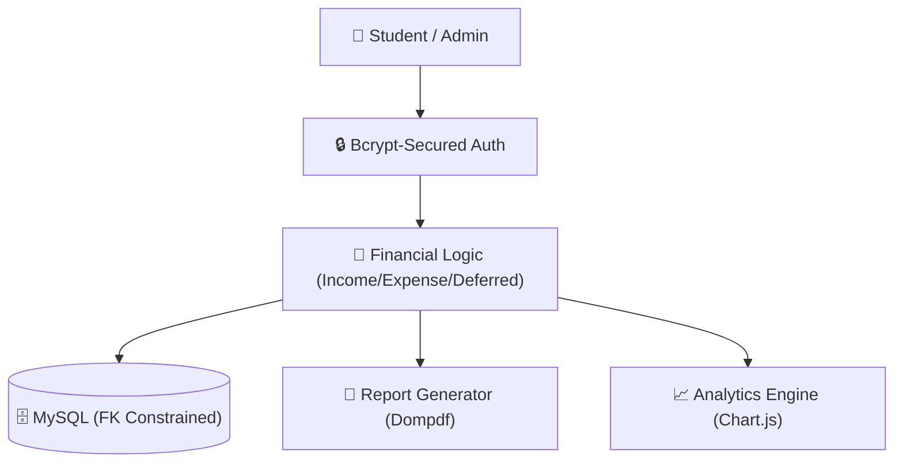
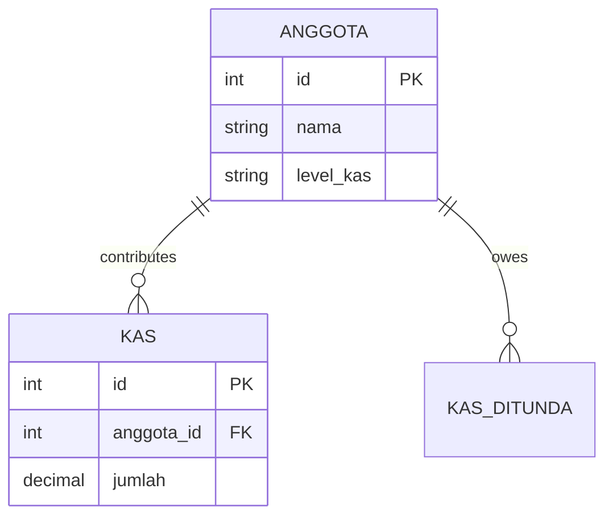

# 💰 Cash Flow Manager — Financial Visualization System

A comprehensive financial modernization system built with **PHP** and **MySQL**. Re-engineered from a legacy codebase, this platform features industrial-grade Bcrypt security, ACID-compliant relational integrity, and high-fidelity data visualization.

[](https://cash-flow-production-d733.up.railway.app)
[](https://php.net)
[](https://mysql.com)
[](https://chartjs.org)

---

## 🏗 System Architecture

The transition from legacy logic to a modern structured flow involves a secure Auth middleware and normalized data handling.



---

## ✨ Features

- **🛡 Modernized Security:** Successfully migrated from legacy MD5 hashing to secure Bcrypt patterns with cost factors of 12.
- **📊 Fiscal Analytics:** Real-time 6-month income vs expense visualization using interactive Chart.js modules.
- **⏳ Deferred Tracking:** Specialized logical flow for tracking and alerting on pending/deferred member payments.
- **🖨 Audit Reports:** Server-side PDF generation for formal financial records with period-based filtering.
- **🔗 Relational Integrity:** Strictly enforced DB constraints (InnoDB) to ensure 0% orphaned financial records.

---

## 🗄 Database Schema

The schema is optimized for financial consistency and historical auditing.



---

## 🚀 Local Installation

### Prerequisites
- PHP 8.1+
- MySQL 8.0
- Composer

### Setup Steps
1. **Clone & Setup:**
   ```bash
   git clone https://github.com/B3rlinSugi/cash-flow.git
   cd cash-flow
   composer install
   ```

2. **Database:**
   Update `config/database.php` with your credentials and initialize the schema using `database/cashflow.sql`.

---

## 👨‍💻 Developed By

**Berlin Sugiyanto Hutajulu**

[](https://github.com/B3rlinSugi)
[](https://linkedin.com/in/berlinsugi)
[](https://berlinsugi.vercel.app)

---
<p align="center">Built with ❤️ and Modern PHP · Financial Integrity Simplified</p>
gi)
[](https://berlinsugi.vercel.app)

---

<p align="center">Built with ❤️ for class financial management · Deployed on Railway</p>
